# Architecture Diagrams

This document contains architecture diagrams for the Employee Management System (EMS) application, rendered using MermaidJS syntax. You can copy the Mermaid code blocks into a compatible renderer (e.g., online editors, some Markdown editors, or plugins) to view the diagrams.

## 1. Local Docker Compose Architecture (with Eureka)

This diagram illustrates the high-level architecture when running the application locally using `docker-compose -f deploy/docker-compose.yml` (which activates the `local-eureka` profile for services).

```mermaid
graph TD
    subgraph "User's Browser"
        U[User]
    end

    subgraph "Docker Network (ems-network)"
        LB_NODE["web-proxy/nginx:80"]
        FE_NODE["frontend:80/nginx"]
        APIGW_NODE["api-gateway:8080"]
        CS_NODE["config-server:8888"]
        DS_NODE["department-service:8081"]
        ES_NODE["employee-service:8082"]
        SR_NODE["service-registry/Eureka:8761"]
        DB_DEPT_NODE["mysql_department:3306"]
        DB_EMP_NODE["mysql_employee:3308"]
        RMQ_NODE["rabbitmq:5672"]
        GIT_NODE["Git Repo (External)"]
        ZIPKIN_NODE["zipkin:9411"]
        ADMINER_NODE["adminer:8085"]
        LOGSTASH_NODE["logstash:5000"]
        ELASTIC_NODE["elasticsearch:9200"]
        KIBANA_NODE["kibana:5601"]
        PROM_NODE["prometheus:9090"]
        GRAFANA_NODE["grafana:3000"]

        LB_NODE --> FE_NODE
        LB_NODE --> APIGW_NODE

        APIGW_NODE -->|Eureka discovery or direct Docker DNS| CS_NODE
        APIGW_NODE -->|Eureka discovery| DS_NODE
        APIGW_NODE -->|Eureka discovery| ES_NODE

        CS_NODE -->|Registers with| SR_NODE
        DS_NODE -->|Registers with & gets config from| SR_NODE
        DS_NODE -->|Config via| CS_NODE
        ES_NODE -->|Registers with & gets config from| SR_NODE
        ES_NODE -->|Config via| CS_NODE
        APIGW_NODE -->|Registers with & gets config from| SR_NODE
        APIGW_NODE -->|Config via| CS_NODE

        DS_NODE --> DB_DEPT_NODE
        ES_NODE --> DB_EMP_NODE
        
        DS_NODE --> RMQ_NODE
        ES_NODE --> RMQ_NODE

        subgraph "Supporting Services (Local Docker Compose)"
            SR_NODE
            CS_NODE --> GIT_NODE
            DB_DEPT_NODE
            DB_EMP_NODE
            RMQ_NODE
            ZIPKIN_NODE
            ADMINER_NODE
            direction LR
        end
        
        APIGW_NODE --> ZIPKIN_NODE
        DS_NODE --> ZIPKIN_NODE
        ES_NODE --> ZIPKIN_NODE

        subgraph "Optional: Logging (Profile)"
            LOGSTASH_NODE --> ELASTIC_NODE
            KIBANA_NODE --> ELASTIC_NODE
            direction LR
        end
        
        subgraph "Optional: Monitoring (Profile)"
            PROM_NODE
            GRAFANA_NODE --> PROM_NODE
            direction LR
        end
        %% Service interactions with logging/monitoring not shown for brevity
    end

    U --> LB_NODE

    classDef springService fill:#lightgreen,stroke:#333,stroke-width:2px;
    classDef db fill:#lightblue,stroke:#333,stroke-width:2px;
    classDef mq fill:#orange,stroke:#333,stroke-width:2px;
    classDef tool fill:#lightgrey,stroke:#333,stroke-width:2px;
    classDef eureka fill:#MistyRose,stroke:#333,stroke-width:2px;

    class APIGW_NODE,CS_NODE,DS_NODE,ES_NODE springService;
    class DB_DEPT_NODE,DB_EMP_NODE db;
    class RMQ_NODE mq;
    class SR_NODE eureka;
    class ZIPKIN_NODE,ADMINER_NODE,LOGSTASH_NODE,ELASTIC_NODE,KIBANA_NODE,PROM_NODE,GRAFANA_NODE,FE_NODE,LB_NODE tool;
```



**Key for Local Diagram:**
*   Arrows indicate primary request flow or registration/discovery.
*   `service-registry` acts as the Eureka server.
*   Microservices (`config-server`, `api-gateway`, `department-service`, `employee-service`) register with Eureka and use it to discover each other (especially `api-gateway` discovering backends, and all services discovering `config-server`).
*   `web-proxy` (Nginx) acts as the main entry point, routing to `frontend` or `api-gateway`.

## 2. Kubernetes Deployment Architecture (Minikube)

This diagram illustrates the high-level architecture when deploying the application to Kubernetes (using manifests in `deploy/k8s/`). Service discovery is handled by Kubernetes DNS.

```mermaid
graph TD
    subgraph "User's Browser/Client"
        U[User]
    end

    subgraph "Kubernetes Cluster (ems-app Namespace)"
        INGRESS_NODE["Ingress (ems.localdev.me)"]
        GIT_EXT_NODE["Git Repo (External)"]

        subgraph "Deployments & StatefulSets"
            APIGW_P["Pod: api-gateway"]
            CS_P["Pod: config-server"]
            DS_P["Pod: department-service"]
            ES_P["Pod: employee-service"]
            FE_P["Pod: frontend"]
            SR_P["Pod: service-registry (Eureka disabled)"]
            ZIPKIN_P["Pod: zipkin"]
            ADMINER_P["Pod: adminer"]

            DB_DEPT_STS["STS: mysql-department"]
            PVC_DEPT["PVC: department-db"]
            DB_EMP_STS["STS: mysql-employee"]
            PVC_EMP["PVC: employee-db"]
            RMQ_STS["STS: rabbitmq"]
            PVC_RMQ["PVC: rabbitmq-data"]
            
            DB_DEPT_STS --> PVC_DEPT
            DB_EMP_STS --> PVC_EMP
            RMQ_STS --> PVC_RMQ
            
            subgraph "Logging Stack"
                LOGSTASH_P["Pod: logstash"]
                ELASTIC_STS["STS: elasticsearch"]
                PVC_ELASTIC["PVC: elastic-data"]
                KIBANA_P["Pod: kibana"]
                
                LOGSTASH_P --> ELASTIC_STS
                ELASTIC_STS --> PVC_ELASTIC
                KIBANA_P --> ELASTIC_STS
                direction LR
            end

            subgraph "Monitoring Stack"
                PROM_P["Pod: prometheus"]
                PVC_PROM["PVC: prometheus-data"]
                GRAFANA_P["Pod: grafana"]
                PVC_GRAFANA["PVC: grafana-data"]

                PROM_P --> PVC_PROM
                GRAFANA_P --> PVC_GRAFANA
                GRAFANA_P --> PROM_P
                direction LR
            end
        end

        subgraph "Services (ClusterIP)"
            APIGW_SVC["Svc: api-gateway"]
            CS_SVC["Svc: config-server"]
            DS_SVC["Svc: department-service"]
            ES_SVC["Svc: employee-service"]
            FE_SVC["Svc: frontend"]
            SR_SVC["Svc: service-registry"]
            DB_DEPT_SVC["Svc: mysql-department"]
            DB_EMP_SVC["Svc: mysql-employee"]
            RMQ_SVC["Svc: rabbitmq"]
            ZIPKIN_SVC["Svc: zipkin"]
            ADMINER_SVC["Svc: adminer"]
            ELASTIC_SVC["Svc: elasticsearch"]
            LOGSTASH_SVC["Svc: logstash"]
            KIBANA_SVC["Svc: kibana"]
            PROM_SVC["Svc: prometheus"]
            GRAFANA_SVC["Svc: grafana"]
        end

        INGRESS_NODE --> FE_SVC
        INGRESS_NODE -- Path /api --> APIGW_SVC
        INGRESS_NODE -- Path /grafana --> GRAFANA_SVC
        INGRESS_NODE -- Path /kibana --> KIBANA_SVC
        INGRESS_NODE -- Path /zipkin --> ZIPKIN_SVC
        INGRESS_NODE -- Path /adminer --> ADMINER_SVC
        
        APIGW_P -->|K8s DNS| CS_SVC
        APIGW_P -->|K8s DNS| DS_SVC
        APIGW_P -->|K8s DNS| ES_SVC

        DS_P -->|K8s DNS| CS_SVC
        ES_P -->|K8s DNS| CS_SVC
        SR_P -->|K8s DNS| CS_SVC %% If service-registry is a client of config-server

        DS_P -->|K8s DNS| DB_DEPT_SVC
        ES_P -->|K8s DNS| DB_EMP_SVC
        
        DS_P -->|K8s DNS| RMQ_SVC
        ES_P -->|K8s DNS| RMQ_SVC
        
        CS_P --> GIT_EXT_NODE

        %% Pods connect to services
        APIGW_P -.-> APIGW_SVC
        CS_P -.-> CS_SVC
        DS_P -.-> DS_SVC
        ES_P -.-> ES_SVC
        FE_P -.-> FE_SVC
        SR_P -.-> SR_SVC
        DB_DEPT_STS -.-> DB_DEPT_SVC
        DB_EMP_STS -.-> DB_EMP_SVC
        RMQ_STS -.-> RMQ_SVC
        ZIPKIN_P -.-> ZIPKIN_SVC
        ADMINER_P -.-> ADMINER_SVC
        LOGSTASH_P -.-> LOGSTASH_SVC
        KIBANA_P -.-> KIBANA_SVC
        ELASTIC_STS -.-> ELASTIC_SVC
        PROM_P -.-> PROM_SVC
        GRAFANA_P -.-> GRAFANA_SVC

        %% Logging and Monitoring data flow (conceptual)
        %% APIGW_P -- logs --> LOGSTASH_P (via node log collector typically)
        %% DS_P -- metrics --> PROM_P (via /actuator/prometheus)
    end
    U --> INGRESS_NODE

    classDef k8sDeployment fill:#lightgreen,stroke:#333,stroke-width:2px;
    classDef k8sStatefulSet fill:#PaleTurquoise,stroke:#333,stroke-width:2px;
    classDef k8sService fill:#Gold,stroke:#333,stroke-width:2px;
    classDef k8sPVC fill:#Wheat,stroke:#333,stroke-width:2px;
    classDef k8sTool fill:#lightgrey,stroke:#333,stroke-width:2px;
    classDef k8sIngress fill:#Plum,stroke:#333,stroke-width:2px;

    class APIGW_P,CS_P,DS_P,ES_P,FE_P,SR_P,ZIPKIN_P,ADMINER_P,LOGSTASH_P,KIBANA_P,PROM_P,GRAFANA_P k8sDeployment;
    class DB_DEPT_STS,DB_EMP_STS,RMQ_STS,ELASTIC_STS k8sStatefulSet;
    class APIGW_SVC,CS_SVC,DS_SVC,ES_SVC,FE_SVC,SR_SVC,DB_DEPT_SVC,DB_EMP_SVC,RMQ_SVC,ZIPKIN_SVC,ADMINER_SVC,ELASTIC_SVC,LOGSTASH_SVC,KIBANA_SVC,PROM_SVC,GRAFANA_SVC k8sService;
    class PVC_DEPT,PVC_EMP,PVC_RMQ,PVC_ELASTIC,PVC_PROM,PVC_GRAFANA k8sPVC;
    class INGRESS_NODE k8sIngress;
```

**Key for Kubernetes Diagram:**
*   `Ingress` is the main entry point from outside the cluster.
*   Services (`Svc`) provide stable internal endpoints (ClusterIPs) and DNS names.
*   Pods (Deployments like `APIGW_P` or StatefulSets like `DB_DEPT_STS`) run the actual application containers.
*   Service discovery is via Kubernetes DNS (e.g., `api-gateway` Pod calls `department-service` Service).
*   `service-registry` Pod runs with Eureka disabled; its original discovery role is handled by K8s DNS.
*   PersistentVolumeClaims (PVCs) provide storage for stateful applications.

These diagrams are simplified and focus on key interactions. More detailed views could be created for specific flows.
```
