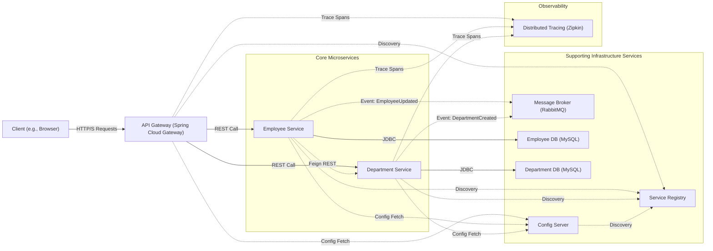

# System Architecture

This document provides an in-depth overview of the Employee Management System (EMS) architecture, including its microservices, design patterns, and best practices for service design.

## System Architecture Diagram (Logical View)

This diagram illustrates the logical architecture of the EMS, showing the key microservices and their interactions.

## Microservices Overview

The EMS application is composed of the following key microservices:

*   **Frontend (`frontend/`)**:
    *   **Description**: A React/TypeScript single-page application providing the user interface for interacting with the EMS.
    *   **Technologies**: React, TypeScript, Vite, Nginx (for serving).
*   **API Gateway (`api-gateway/`)**:
    *   **Description**: The single entry point for all client requests. It handles routing to appropriate backend services, and can manage cross-cutting concerns like authentication, rate limiting, and load balancing.
    *   **Technologies**: Spring Cloud Gateway.
    *   **Details**: Routes are dynamically configured via the Config Server. In local setups, it can use Eureka for service discovery; in Kubernetes, it uses K8s DNS.
*   **Config Server (`config-server/`)**:
    *   **Description**: Centralizes configuration management for all microservices. Configurations are typically stored in a Git repository.
    *   **Technologies**: Spring Cloud Config Server.
    *   **Details**: Services fetch their configurations from the Config Server on startup.
*   **Service Registry (`service-registry/`)**:
    *   **Description**: Enables service discovery. In local Docker Compose environments (with `local-eureka` profile), this runs as a Netflix Eureka server where services register and discover each other.
    *   **Technologies**: Netflix Eureka Server.
    *   **Details**: In Kubernetes deployments, this service's Eureka server capabilities are disabled, and Kubernetes DNS is used for service discovery. The Spring Boot application itself might still run (e.g. to be a client of config-server) but not as a Eureka server.
*   **Employee Service (`employee-service/`)**:
    *   **Description**: Manages all employee-related data and operations (CRUD).
    *   **Technologies**: Spring Boot, Spring Data JPA, MySQL.
    *   **Details**: Communicates with the Department Service via Feign Client for department-related information. Integrates Resilience4j for fault tolerance.
*   **Department Service (`department-service/`)**:
    *   **Description**: Manages all department-related data and operations (CRUD).
    *   **Technologies**: Spring Boot, Spring Data JPA, MySQL.
*   **Message Broker (RabbitMQ)**:
    *   **Description**: Facilitates asynchronous communication between microservices using an event-driven approach.
    *   **Technologies**: RabbitMQ.
    *   **Details**: Services can publish messages/events (e.g., "EmployeeCreated") and other services can subscribe to these events.
*   **Distributed Tracing Server (Zipkin)**:
    *   **Description**: Provides distributed tracing capabilities to monitor and debug requests as they flow across multiple microservices.
    *   **Technologies**: Zipkin, Spring Cloud Sleuth (integrated into services).

## Design Patterns Used

The EMS project incorporates several design patterns to ensure a robust, scalable, and maintainable system:

*   **API Gateway Pattern**:
    *   **Implementation**: Spring Cloud Gateway acts as the central entry point.
    *   **Benefits**: Encapsulates internal system structure, provides a single point for cross-cutting concerns (routing, security, rate limiting), simplifies client interaction.
*   **Service Registry Pattern**:
    *   **Implementation**: Netflix Eureka for local development; Kubernetes DNS for cluster deployments.
    *   **Benefits**: Enables dynamic discovery of service instances, facilitating inter-service communication without hardcoded addresses.
*   **Centralized Configuration Pattern**:
    *   **Implementation**: Spring Cloud Config Server with a Git backend.
    *   **Benefits**: Manages all microservice configurations in a central place, allowing for dynamic updates and environment-specific settings without service restarts (if refresh scope is enabled).
*   **Database per Service Pattern**:
    *   **Implementation**: `employee-service` and `department-service` each have their own dedicated MySQL database.
    *   **Benefits**: Ensures loose coupling between services, allows services to choose their own database technology if needed, improves scalability and data autonomy.
*   **Circuit Breaker Pattern**:
    *   **Implementation**: Resilience4j is integrated (e.g., in Employee Service for calls to Department Service).
    *   **Benefits**: Prevents cascading failures by stopping requests to failing services and providing fallback mechanisms, improving system resilience.
*   **Repository Pattern**:
    *   **Implementation**: Spring Data JPA repositories abstract data access logic from business logic.
    *   **Benefits**: Simplifies data access, promotes separation of concerns, makes it easier to switch data storage technologies.
*   **Data Transfer Object (DTO) Pattern**:
    *   **Implementation**: Used for communication between service layers and over the network.
    *   **Benefits**: Encapsulates only necessary data, reducing payload size, improving performance, and decoupling service contracts from internal domain models.
*   **Sidecar Pattern (Conceptual)**:
    *   **Mentioned in `README.md`**: While not explicitly implemented with dedicated sidecar containers for all auxiliary tasks like monitoring/logging in the current Docker Compose setup (these are often standalone services), the concept is relevant. In Kubernetes, common sidecars include log shippers (Fluentd), service mesh proxies (Envoy, Linkerd), or security agents. The current ELK and Prometheus setups are more centralized but serve similar goals.

## Domain-Driven Design (DDD) & Modular Structure

The architecture reflects principles of Domain-Driven Design by organizing services around specific business domains:

*   **Bounded Contexts**: `Employee Service` and `Department Service` represent distinct bounded contexts, each responsible for its own domain entities, logic, and data.
*   **Modularity**: The microservice architecture inherently promotes modularity. Each service is a self-contained unit that can be developed, deployed, and scaled independently. This reduces complexity and improves maintainability.
*   **Clear Interfaces**: Services communicate through well-defined APIs (REST, events), enforcing separation and clear contracts.

## Best Practices for Service Design & Operations

*   **Stateless Services**: Design backend services (especially `api-gateway`, `employee-service`, `department-service`) to be stateless where possible. This simplifies scaling and improves resilience, as any instance of a service can handle any request. State should be externalized to databases or caches.
*   **Idempotency**: Design API operations to be idempotent, especially for write operations. This means multiple identical requests have the same effect as a single request, which is crucial for safe retries.
*   **Asynchronous Communication**: Utilize RabbitMQ for tasks that can be processed asynchronously, improving responsiveness and decoupling services.
*   **Configuration Management**:
    *   Externalize all configurations using Spring Cloud Config Server.
    *   Use Kubernetes ConfigMaps for non-sensitive K8s configurations and Secrets for sensitive data.
*   **Logging**:
    *   Log to `stdout` and `stderr` from containers.
    *   Use a structured logging format (e.g., JSON).
    *   Implement a centralized logging solution (e.g., ELK stack - Elasticsearch, Logstash, Kibana) to aggregate and search logs from all services.
    *   Include correlation IDs (e.g., via Spring Cloud Sleuth) in logs to trace requests across services.
*   **Monitoring & Observability**:
    *   **Distributed Tracing**: Use Zipkin and Spring Cloud Sleuth to trace requests across service boundaries.
    *   **Metrics**: Expose application and system metrics using tools like Prometheus (via Spring Boot Actuator's `/actuator/prometheus` endpoint).
    *   **Dashboards**: Visualize metrics and logs using Grafana and Kibana.
    *   **Alerting**: Set up alerts based on key metrics and log patterns to proactively identify and respond to issues.
*   **Health Checks & Probes**:
    *   Implement comprehensive health check endpoints in each service (e.g., Spring Boot Actuator's `/actuator/health`).
    *   Configure Kubernetes Liveness, Readiness, and (if needed) Startup probes to ensure automated recovery and safe deployments.
*   **Fault Tolerance & Resilience**:
    *   Implement **retry mechanisms** with exponential backoff for transient failures in inter-service communication.
    *   Use the **Circuit Breaker pattern** (Resilience4j) to prevent cascading failures when services are down or degraded. Provide meaningful fallbacks where possible.
*   **Security**:
    *   Secure inter-service communication (e.g., mTLS in Kubernetes).
    *   Protect API Gateway endpoints (e.g., with OAuth2/OIDC).
    *   Manage secrets securely using Kubernetes Secrets or dedicated secret management tools (e.g., HashiCorp Vault, OCI Vault).
    *   Follow the principle of least privilege for database access and Kubernetes RBAC.
*   **API Design**:
    *   Design RESTful APIs with clear, consistent, and versioned endpoints.
    *   Use appropriate HTTP status codes.
    *   Validate input data.
