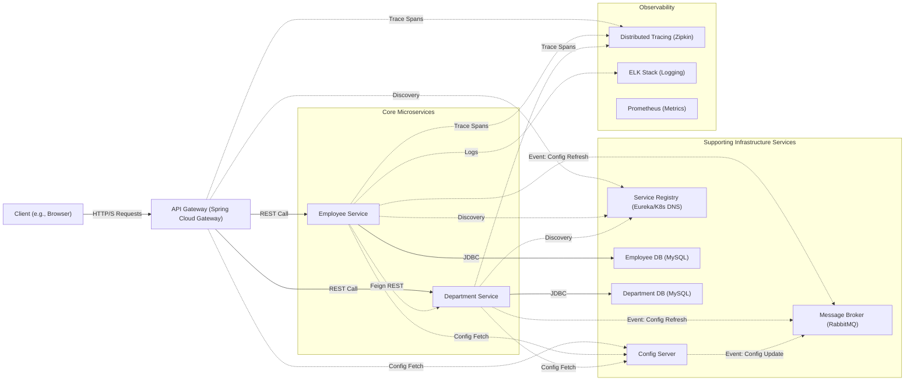

# System Architecture

This document provides an in-depth overview of the Employee Management System (EMS) architecture, detailing how components interact in both Local (Docker Compose) and Kubernetes environments.

## System Architecture Diagram (Logical View)

This diagram illustrates the logical architecture of the EMS, showing the key microservices and their interactions.

```mermaid
%%{ init: { "theme": "default", "flowchart": { "curve": "basis", "rankSpacing": 50, "nodeSpacing": 40 } } }%%
flowchart LR
  %% Clients
  user["Client (e.g., Browser)"]

  %% Gateway
  api_gateway["API Gateway (Spring Cloud Gateway)"]

  %% Core Microservices
  subgraph "Core Microservices"
    employee_service["Employee Service"]
    department_service["Department Service"]
  end

  %% Supporting Infrastructure
  subgraph "Supporting Infrastructure Services"
    config_server["Config Server"]
    service_registry["Service Registry (Eureka/K8s DNS)"]
    message_broker["Message Broker (RabbitMQ)"]
    db_employee["Employee DB (MySQL)"]
    db_department["Department DB (MySQL)"]
  end

  %% Observability
  subgraph "Observability"
    tracing_server["Distributed Tracing (Zipkin)"]
    elk["ELK Stack (Logging)"]
    prometheus["Prometheus (Metrics)"]
  end

  %% Main flow
  user -->|HTTP/S Requests| api_gateway
  api_gateway -->|REST Call| employee_service
  api_gateway -->|REST Call| department_service

  employee_service -->|JDBC| db_employee
  department_service -->|JDBC| db_department

  employee_service -.->|Feign REST| department_service

  %% Async
  employee_service -.->|Event: Config Refresh| message_broker
  department_service -.->|Event: Config Refresh| message_broker
  config_server -.->|Event: Config Update| message_broker

  %% Config
  api_gateway -.->|Config Fetch| config_server
  employee_service -.->|Config Fetch| config_server
  department_service -.->|Config Fetch| config_server

  %% Discovery
  api_gateway -.->|Discovery| service_registry
  employee_service -.->|Discovery| service_registry
  department_service -.->|Discovery| service_registry

  %% Tracing & Logging
  api_gateway -.->|Trace Spans| tracing_server
  employee_service -.->|Trace Spans| tracing_server
  department_service -.->|Trace Spans| tracing_server

  employee_service -.->|Logs| elk
```

## Environment-Specific Architecture

The application runs in two primary environments: **Local (Docker Compose)** and **Kubernetes**. While the business logic remains the same, the infrastructure plumbing (Service Discovery, Configuration, Networking) differs.

### 1. Local Development (Docker Compose)

In the local environment, `docker-compose.yml` (and `.dev.yml`) orchestrates the containers.

*   **Service Discovery**: **Netflix Eureka**
    *   **Mechanism**: The `service-registry` container runs a Eureka Server on port `8761`.
    *   **Registration**: Services (`employee-service`, `department-service`, `api-gateway`) are configured with the `local-eureka` profile. They register themselves with Eureka using `http://service-registry:8761/eureka`.
    *   **Resolution**: Clients (like `api-gateway` or `employee-service`) query Eureka to find the IP/Port of other services.
*   **API Gateway**:
    *   **Port**: `8080` (mapped to host `8080`).
    *   **Routing**: Uses `lb://SERVICE-NAME` URIs to route traffic via Eureka.
*   **Config Server**:
    *   **Access**: Services access it via `http://config-server:8888`.
    *   **Backend**: Fetches configuration from a remote Git repository (Github).
*   **Frontend**:
    *   **Access**: Exposed on port `3001` or `80` (via Nginx proxy).
    *   **Connection**: Sends API requests to `http://localhost:8080` (API Gateway).

### 2. Kubernetes (K8s)

In the Kubernetes environment, the platform's native capabilities replace some Spring Cloud components.

*   **Service Discovery**: **Kubernetes DNS (CoreDNS)**
    *   **Mechanism**: Each service (`employee-service`, `department-service`) is exposed as a K8s `Service`.
    *   **Registration**: Not required. K8s handles it automatically.
    *   **Resolution**: Services call each other using DNS names (e.g., `http://department-service:8081`). Eureka is typically disabled or ignored.
*   **API Gateway**:
    *   **Routing**: Uses `http://service-name:port` URIs to route traffic via K8s DNS.
*   **Config Server**:
    *   **Access**: Exposed as a K8s Service (`config-server`). Other pods access it via `http://config-server:8888`.
*   **Frontend**:
    *   **Access**: Exposed via an Ingress or NodePort.
    *   **Connection**: Calls the API Gateway's external IP/DNS.

---

## Component Deep Dive & Connections

### API Gateway
*   **Role**: Entry point for all external traffic.
*   **Connections**:
    *   **Inbound**: From Client/Frontend.
    *   **Outbound**: To `employee-service` and `department-service`.
    *   **Discovery**: Queries `service-registry` (Local) or uses K8s DNS (Prod).
    *   **Config**: Fetches startup config from `config-server`.

### Service Discovery (Eureka)
*   **Role**: Registry of active service instances (Local only).
*   **Connections**:
    *   **Inbound**: Heartbeats and registration requests from all backend services.

### Config Server
*   **Role**: Centralized configuration management.
*   **Connections**:
    *   **Outbound**: Pulls config from **GitHub**.
    *   **Inbound**: Requests from all services (`api-gateway`, `employee`, `department`) on startup.
    *   **Bus**: Publishes refresh events to **RabbitMQ**.

### Microservices (Employee & Department)
*   **Role**: Business logic owners.
*   **Connections**:
    *   **Employee -> Department**: Synchronous REST call (via OpenFeign).
    *   **Database**: Each connects to its own **MySQL** container (`mysql_employee`, `mysql_department`).
    *   **Config**: Fetches from `config-server`.

### Frontend
*   **Role**: User Interface (React).
*   **Connections**:
    *   **Outbound**: HTTP requests to **API Gateway**.

### Zipkin
*   **Role**: Distributed Tracing.
*   **Connections**:
    *   **Inbound**: Trace spans sent (via HTTP or RabbitMQ) from all Spring Boot services.
    *   **User**: Developer views traces at `http://localhost:9411`.

### Logging (ELK Stack) & Monitoring
*   **Elasticsearch**: Stores logs.
*   **Logstash**: Ingests logs from services (via TCP/UDP or file beats) and sends to Elasticsearch.
*   **Kibana**: Visualizes logs from Elasticsearch.
*   **Prometheus**: Scrapes metrics from `/actuator/prometheus` endpoints on all services.
*   **Grafana**: Visualizes metrics from Prometheus.

---

## Analysis of RabbitMQ and Resilience4j

### 1. RabbitMQ
**Purpose:** RabbitMQ is currently used as a message broker for **Spring Cloud Bus**.

*   **Evidence in Code**: `spring-cloud-starter-bus-amqp` dependency.
*   **Functionality**:
    *   **Dynamic Configuration Refresh**: Its primary role is to facilitate dynamic configuration updates. When a property is updated in the Git repo, a request to `/actuator/bus-refresh` (on any service) triggers a message to RabbitMQ.
    *   **Broadcasting**: RabbitMQ broadcasts this event to all connected microservices, prompting them to reload their `@RefreshScope` beans without a restart.

### 2. Resilience4j
**Purpose:** Resilience4j is a fault tolerance library (Circuit Breaker, Rate Limiter, Retry, etc.) used to improve the stability and reliability of the system.

*   **Current Status**: **Integrated in Employee Service.**
*   **Fault Tolerance Implementation:**
    *   **Circuit Breaker**: Stops calling a failing microservice (e.g., if `department-service` is down, `employee-service` will return a default "R&D Department" response quickly instead of waiting for a timeout).
    *   **Retry**: Automatically retries failed requests that might be temporary (like a network glitch).
    *   **Rate Limiter**: Limits the number of calls to a service to prevent overload.
