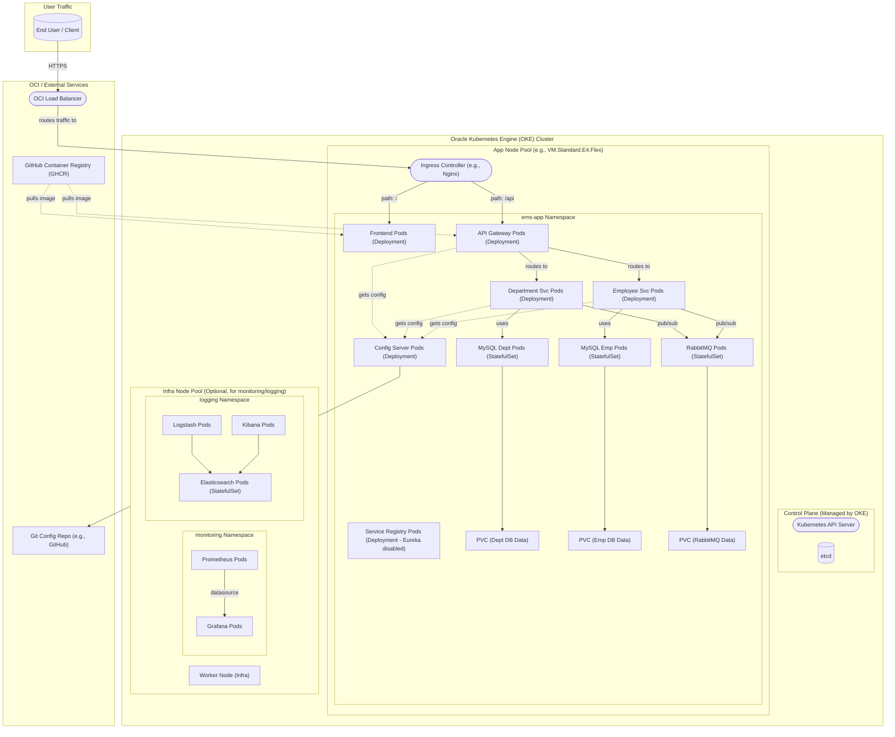

# Kubernetes Configuration and Best Practices (OKE Focused)

This document details Kubernetes configurations, resource management strategies, autoscaling concepts, and best practices relevant for deploying the Employee Management System (EMS) on a Kubernetes cluster, with a focus on Oracle Kubernetes Engine (OKE).

## Oracle Kubernetes Engine (OKE) Specifics

While the EMS application's Kubernetes manifests are designed to be generally portable, deploying to OKE allows leveraging Oracle Cloud Infrastructure (OCI) integrations.

*   **OCI Service Integration**: OKE can integrate with OCI services like Load Balancers (for Kubernetes Services of type `LoadBalancer`), Block Volume (for PersistentVolumes), OCI Registry (OCIR), and IAM for authentication and authorization.
*   **Networking**: OKE typically uses flannel or the OCI VCN-Native CNI for Pod networking. Specific annotations might be required for OCI Load Balancers (e.g., for SSL certificates, shaping traffic).
*   **Node Pools**: OKE manages worker nodes in Node Pools. These allow for different machine shapes (VM.Standard.E4.Flex, etc.), OS images, and configurations for different parts of your workload.

*(This section can be expanded with more OKE-specific details as the project evolves, such as specific annotations for OCI Load Balancers, IAM integration patterns, or custom StorageClass configurations for OCI Block Volume.)*

## Node Architecture

The current deployment has been tested on an OKE cluster with the following characteristics (as per `resource_optimization.md`):

*   **Nodes**: 2 worker nodes
*   **CPU per Node**: 1 OCPU (equivalent to 2 vCPUs, typically 1000m in Kubernetes per OCPU)
*   **Memory per Node**: 6 GB RAM

This results in a total cluster capacity of approximately 2000m CPU and 12GB RAM available for workloads (minus system overhead).

Worker nodes in OKE can be based on various architectures (e.g., AMD64, ARM64 - Ampere A1). Ensure your Docker images are built for the target node architecture.

## Resource Management: Requests and Limits

Defining resource requests and limits for containers is crucial for cluster stability, effective scheduling, and assigning Quality of Service (QoS) classes.

### Key Concepts
*   **Requests**: Guaranteed CPU/Memory for a container. Used by the scheduler for node placement.
*   **Limits**: Maximum CPU/Memory a container can consume. CPU is throttled if limit is hit; Memory over-limit can lead to OOMKill.
*   **QoS Classes**:
    *   **Guaranteed**: Requests == Limits for all resources in all containers. Highest priority.
    *   **Burstable**: At least one container has requests, but not all match limits. Medium priority.
    *   **BestEffort**: No requests or limits. Lowest priority, first to be evicted.

### Resource Tuning for EMS on OKE (Example)

Due to the limited resources on the example 2-node OKE cluster (2000m total CPU), initial CPU requests for services had to be optimized:

*   **Original Total CPU Requests**: 3050m (exceeded cluster capacity)
*   **Optimized Total CPU Requests**: 1675m (fits within cluster capacity)

**Summary of CPU Request Adjustments (from `resource_optimization.md`):**

| Service Category        | Original CPU Request (Typical) | Optimized CPU Request (Typical) |
|-------------------------|--------------------------------|---------------------------------|
| Core Java Services      | `250m`                         | `150m`                          |
| Supporting Services     | `100m-200m`                    | `50m-100m`                      |
| Databases/Elasticsearch | `200m-500m`                    | `100m-250m`                     |

**Note**: These are starting points. Continuous monitoring and load testing are essential to fine-tune requests and limits for optimal performance and resource utilization. Refer to `resource_optimization.md` for detailed per-service adjustments.

## Namespaces

The application is deployed into the `ems-app` namespace, as defined in `deploy/k8s/base/00-namespace.yaml`. Using namespaces provides:
*   **Scope for names**: Resource names only need to be unique within a namespace.
*   **Resource Quotas**: Ability to set resource quotas per namespace.
*   **Network Policies**: Scope for network policies.
*   **Logical Grouping**: Easier management and separation of applications within a cluster.

## Autoscaling

Autoscaling helps manage fluctuating loads effectively.

### Horizontal Pod Autoscaler (HPA)
*   **Purpose**: Automatically scales the number of Pods in a Deployment or StatefulSet based on observed metrics like CPU utilization, memory usage, or custom metrics.
*   **Configuration**: Requires defining target metric thresholds (e.g., scale up if average CPU utilization across Pods exceeds 70%).
*   **Prerequisites**: Metrics Server must be installed in the cluster. Resource requests must be set on containers for CPU/memory-based scaling.
*   **EMS**: HPA can be applied to stateless services like `api-gateway`, `department-service`, `employee-service`, and `frontend`.

### Cluster Autoscaler (CA)
*   **Purpose**: Automatically adjusts the number of worker nodes in your cluster. If Pods are pending due to insufficient resources, CA provisions new nodes. If nodes are underutilized, CA can deprovision them to save costs.
*   **OKE**: OKE supports Cluster Autoscaler for its node pools.
*   **Configuration**: Typically involves setting min/max node counts for node pools.

## Production-Grade Kubernetes Best Practices

*   **Health Probes**:
    *   **Liveness Probes**: Detect if an application is unresponsive; Kubernetes will restart the container.
    *   **Readiness Probes**: Signal if an application is ready to serve traffic; Kubernetes will only route traffic to ready Pods.
    *   **Startup Probes**: For applications with long startup times, to avoid premature termination by liveness probes.
    *   Utilize Spring Boot Actuator's `/actuator/health`, `/actuator/health/liveness`, `/actuator/health/readiness` endpoints.
*   **Configuration and Secrets Management**:
    *   Use **ConfigMaps** for non-sensitive configuration data.
    *   Use **Secrets** for sensitive data (passwords, API keys, TLS certs). Store them securely (e.g., encrypted in etcd, managed via Vault or OCI Vault).
    *   Mount ConfigMaps/Secrets as environment variables or files, not hardcoded in images.
    *   **Principle of Least Privilege**: Grant applications only the database permissions they need (e.g., dedicated DB users per service, not `root`).
*   **Resource Management**:
    *   **Always set resource requests and limits** for all containers to ensure stability and proper scheduling.
    *   Monitor actual usage and adjust requests/limits iteratively.
*   **Networking**:
    *   Use **NetworkPolicies** to restrict traffic flow between Pods for enhanced security (zero-trust networking).
*   **Storage**:
    *   Use **PersistentVolumeClaims (PVCs)** for stateful applications (databases, message queues).
    *   Choose appropriate **StorageClasses** based on performance and cost requirements (e.g., OCI Block Volume options).
    *   For database initialization, use Init Containers with ConfigMaps for scripts, or tools like Flyway/Liquibase for schema migrations.
*   **Logging and Monitoring**:
    *   Configure applications to log to **`stdout`/`stderr`**.
    *   Use a cluster-wide logging solution (ELK, Fluentd, Loki) to collect and analyze logs.
    *   Implement comprehensive monitoring using Prometheus/Grafana, exposing metrics from applications (e.g., Spring Boot Actuator `/actuator/prometheus`).
*   **Image Management**:
    *   Use **specific image tags** (not `:latest`) in production deployments for predictability.
    *   Implement **multi-stage Docker builds** to create lean production images.
    *   Run containers as **non-root users**.
    *   Scan images for vulnerabilities.
*   **Application Resilience**:
    *   Implement **retry logic** with backoff for inter-service communication and connections to external dependencies.
    *   Use **Circuit Breaker** patterns (e.g., Resilience4j) to prevent cascading failures.
*   **Declarative Deployments (GitOps)**:
    *   Use tools like **ArgoCD** or Flux to manage deployments declaratively from Git, ensuring consistency and auditability.
*   **RBAC (Role-Based Access Control)**:
    *   Configure RBAC policies to restrict user and service account permissions within the cluster based on the principle of least privilege.

## Kubernetes Infrastructure Diagram (Conceptual OKE)

This diagram illustrates a conceptual layout of the EMS application on Oracle Kubernetes Engine (OKE).

